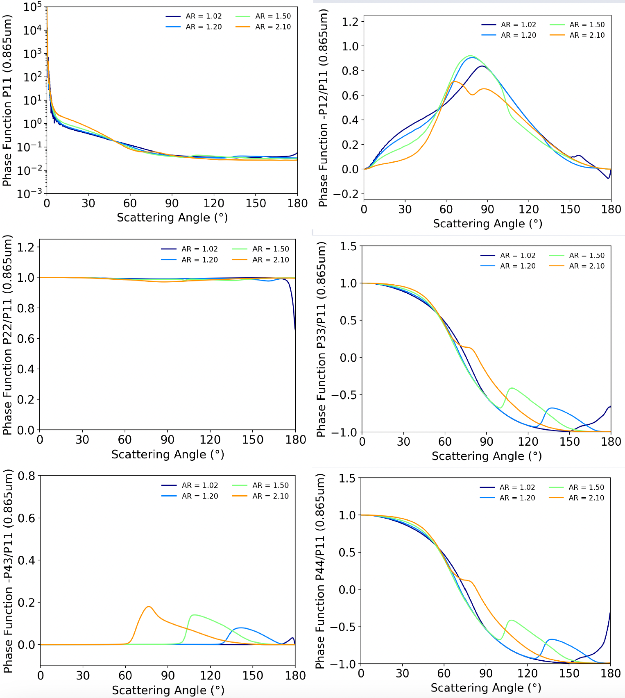

[Poster link](/files/poster/17th-ELS.pdf)

We use an adding‑doubling radiation transfer model and a dust aerosol database to analyze the sensitivity of the radiance to the optical and micro‑physical properties of non‑spherical dust aerosols.

