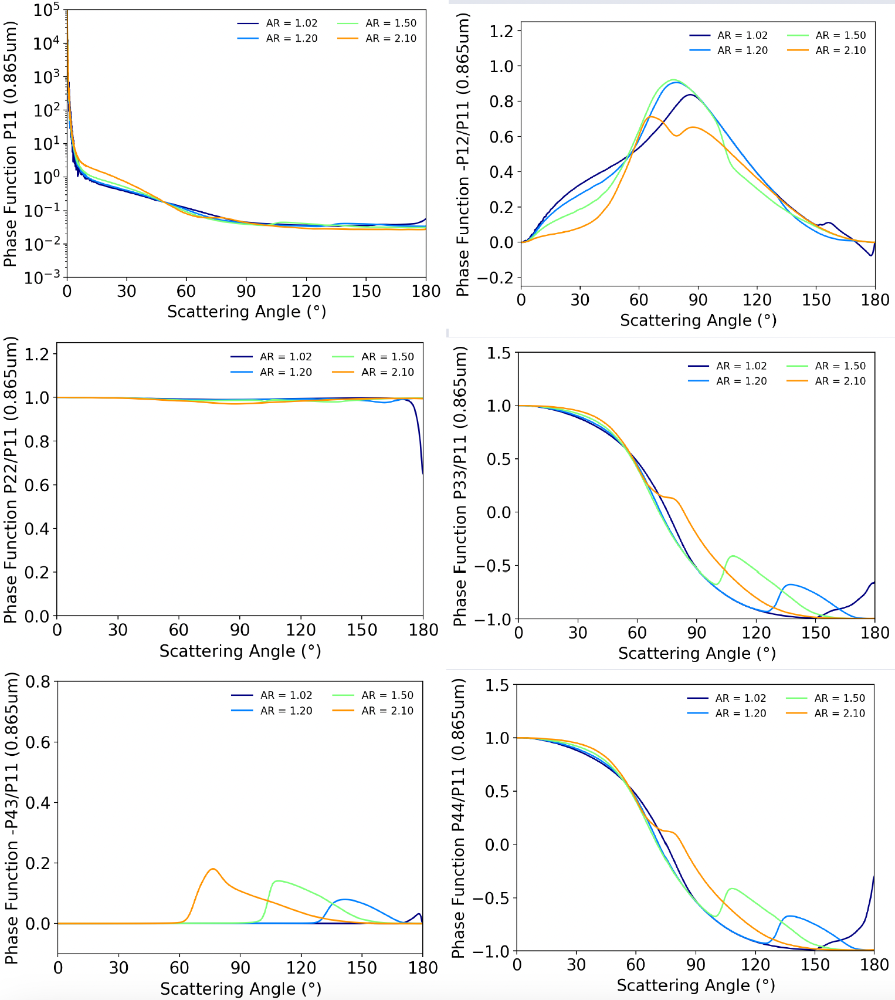
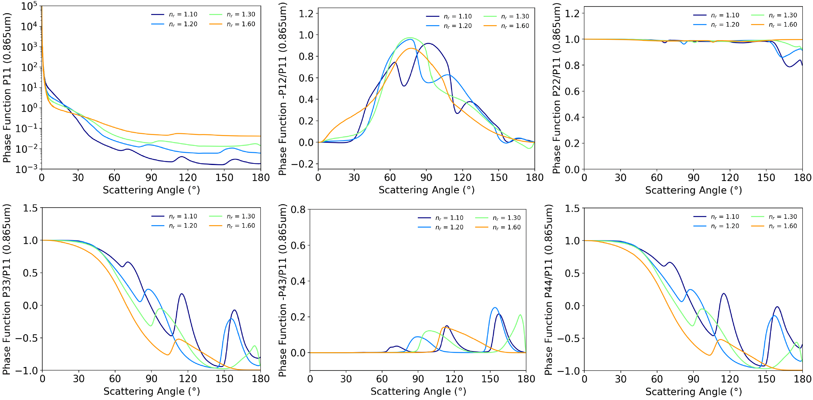
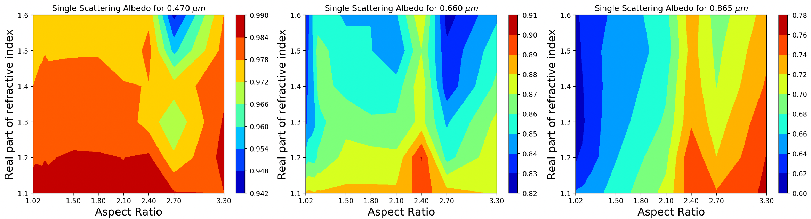
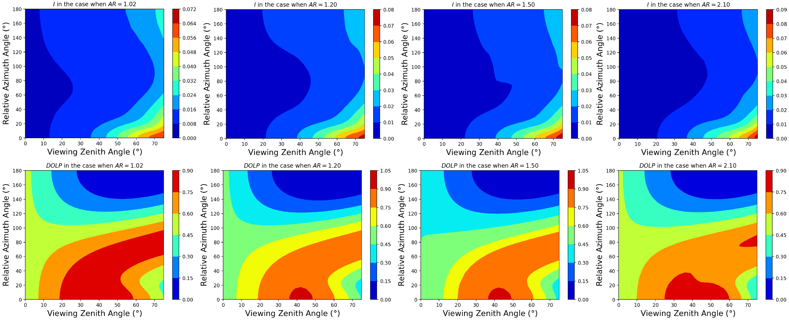
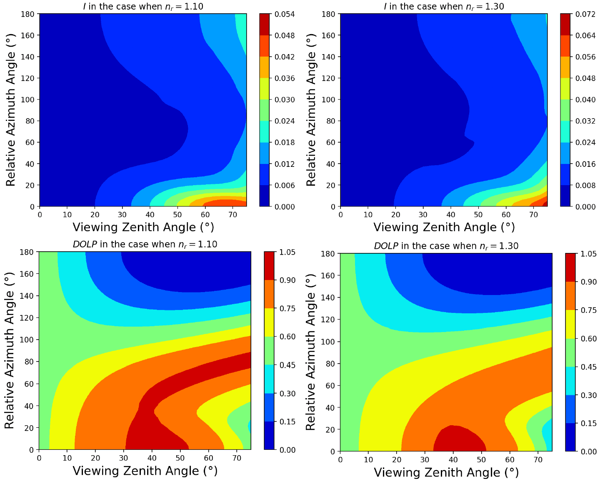
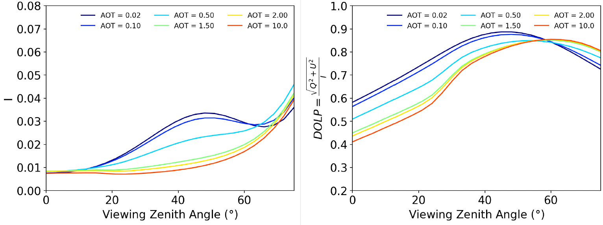

[Poster PDF link](/files/poster/17th-ELS.pdf)

We use an adding‑doubling radiation transfer model and a dust aerosol database to analyze the sensitivity of the radiance to the optical and micro‑physical properties of non‑spherical dust aerosols.

Fig 1. The elements of the scattering phase matrix of the dust aerosol with 4 kinds of aspect ratio (1.02, 1.20, 1.50 and 2.10) at the wavelength of 865nm. Aspect ratio is defined as a/b, where a is the long axis and b is the short axis of the prolate dust particle. The complex refractive index is set to be 1.50+0.001i.

Fig 2. The elements of the scattering phase matrix of the dust aerosol with 4 different values of the real part (nr) of the refractive index at the wavelength of 865nm. The four nr are 1.10, 1.20, 1.30 and 1.60. The imaginary part of the refractive index is set to be 0.001 and the aspect ratio is set to be 1.5.

Fig 3. The single scattering albedo for the three wavelengths of 470nm, 660nm and 865nm with different particle aspect ratio and real part of the refractive index. The imaginary part of the refractive index is set to be 0.001.

Fig 4. The Stokes component I and the DOLP for 4 kinds of aspect ratio (1.02, 1.20, 1.50 and 2.10) at the wavelength of 865nm. The complex refractive index is set to be 1.50+0.001i.

Fig 5. The Stokes component I and the DOLP for 2 different values of the real part (nr) of the refractive index at the wavelength of 865nm. The aspect ratio is set to be 1.5.

Fig 6. The Stokes component I and the DOLP for 6 different values of the aerosol optical thickness (AOT) at the wavelength of 865nm. The aspect ratio is set to be 1.5 and the refractive index is set to be 1.5+0.001i.

Summary and conclusions
=======================

* In this study, we used a ellipsoidal dust aerosol database to investigate the sensitivity of the scattering phase matrix and single scattering albedo to the dust particle aspect ratio and refractive index (the real part). In addition, we investigated the Stokes vector I and the DOLP in different aspect ratio, refractive index and AOT.
* The results shows that particles with different aspect ratio and refractive index shows different scattering properties, including scattering phase matrix and single scattering albedo.
* Different AOT shows different response of Stokes vector to viewing zenith angle.
* The polarization signal would significantly improve the ability to retrieve the particle aspect ratio and refractive index.
