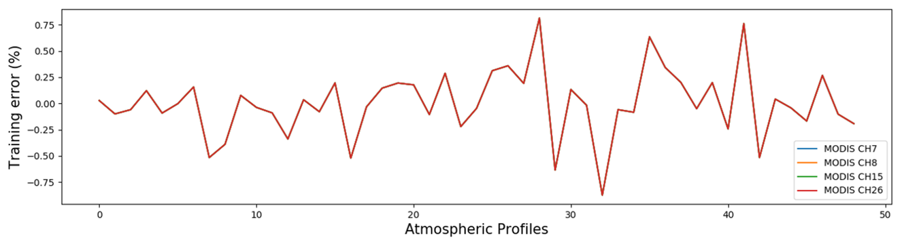
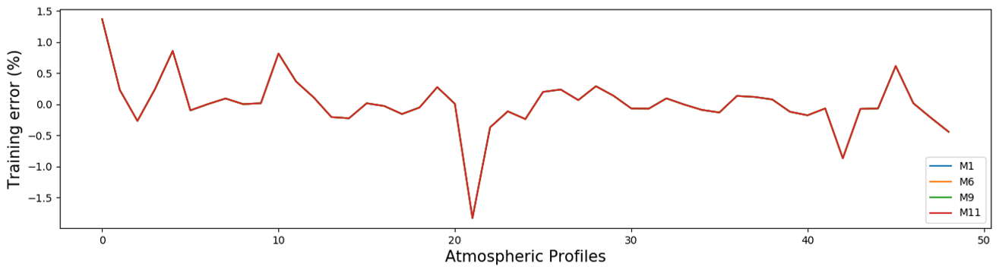
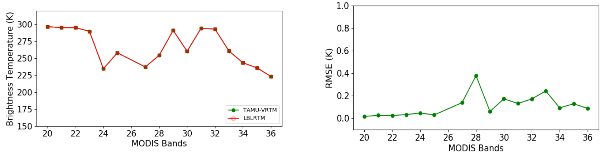
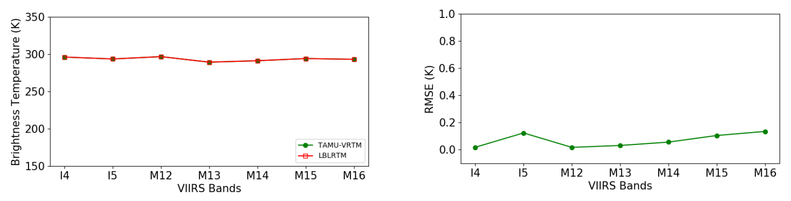
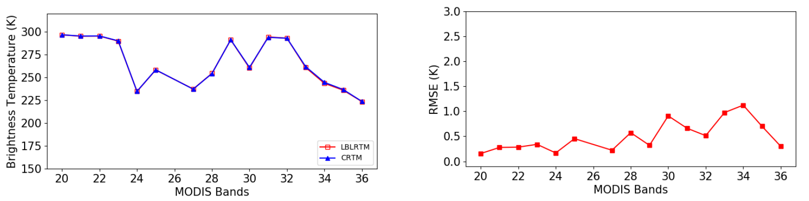
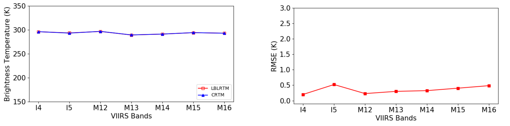

[Poster PDF link](/files/poster/AMS2020.pdf)

We develope a fast numerical radiation transfer model for the Moderate Resolution Imaging Spectroradiometer (MODIS) bands, and compared it with the Community Radiative Transfer Model (CRTM) in terms of gas absorption.

Fig. 1 The training errors at MODIS channel 7 (2.1mm), channel 8 (0.41mm), channel 15 (0.76mm) and channel 26 (1.38mm) for different atmospheric profiles.

Fig. 2 The training errors at VIIRS channel M1 (0.412mm), M6 (0.746mm), M9 (1.378mm) and M11 (2.25mm) for different atmospheric profiles.

Fig. 3 The simulated brightness temperature (left) and brightness temperature RMSE (right) from TAMU-VRTM (green) and LBLRTM (red) in the MODIS bands 20-25, 27-36 (thermal infrared bands) for 49 atmosphere profiles.

Fig. 4 The simulated brightness temperature (left) and brightness temperature RMSE (right) from TAMU-VRTM (green) and LBLRTM (red) in the VIIRS bands I4-I5, M12-M15 (thermal infrared bands) for 49 atmosphere profiles.

Fig. 5 The simulated brightness temperature (left) and brightness temperature RMSE (right) from CRTM (blue) and LBLRTM (red) in the MODIS bands 20-25, 27-36 (thermal infrared bands) for 49 atmosphere profiles.

Fig. 6 The simulated brightness temperature (left) and brightness temperature RMSE (right) from CRTM (blue) and LBLRTM (red) in the VIIRS bands I4-I5, M12-M15 (thermal infrared bands) for 49 atmosphere profiles.

Summary and conclusions
=======================
* The training error of gas absorption algorithm of TAMU-VRTM is less than 0.75% when calculating the channel-averaged optical thickness in MODIS bands and the training error is less than 1.5% in VIIRS bands. 
* Compared with LBLRTM, the in sample root mean square error (RMSE) of TOA brightness temperature by TAMU-VRTM is less than 0.5K for MODIS bands. For the VIIRS bands, the RMSE is less than 0.2K.
* Compared with LBLRTM, the RMSEs of TOA brightness temperature by CRTM are around 0.5K for most MODIS bands and VIIRS bands.
* The gas absorption calculation speeds by TAMU-VRTM and CRTM are both fast, they are at least two orders of magnitude faster than LBLRTM
