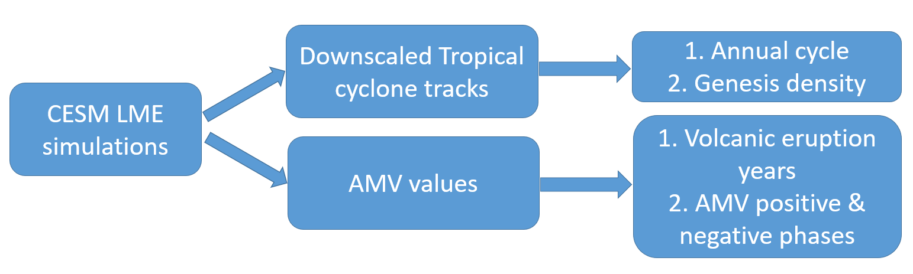
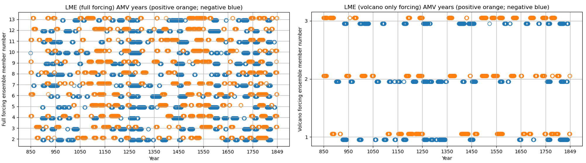
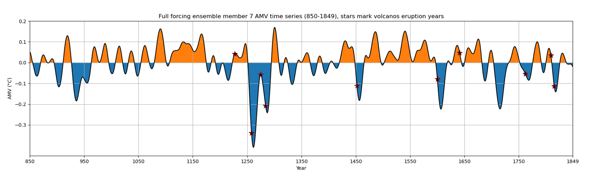
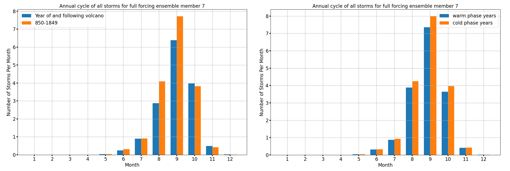
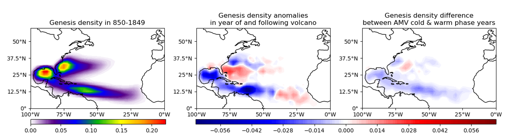
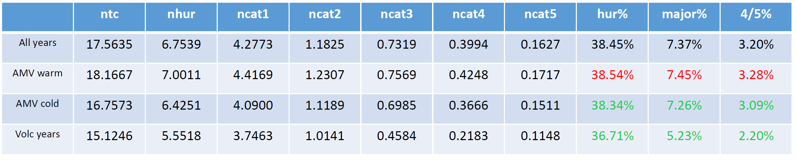

[Poster PDF link](/files/poster/AMS-34th-hurricane.pdf)

We study how volcanic eruptions and the Atlantic Multidecadal Variability affect North Atlantic tropical cyclones. We compare storms during and after eruptions with those from positive/negative AMV phases to understand the AMV's impact.

Data and method flow chart

Fig. 1 Top 200 Atlantic Multidecadal Variability (AMV) years (in orange) and bottom 200 AMV years (in blue) for full forcing ensemble member 2-13 (left) and volcano only forcing ensemble member 1-3 (right.)

Fig. 2 Time series of Atlantic Multidecadal Variability (AMV) in CESM-LME full forcing ensemble member 7. The stars in maroon color mark the 10 volcanos eruptions years and the corresponding AMV values.

Fig. 3 Annual cycle of storms in year of and following volcano compared to all 1000 years in CESM-LME full forcing ensemble member 7 (left) and storms in AMV warm phase years compared to cold phase years (right.)

Fig. 4 Left: genesis density (2.5 deg * 2.5 deg) of all storms for CESM-LME full forcing ensemble member 7 in the whole 1000 years over North Atlantic Ocean; Middle: genesis density anomalies (2.5 deg * 2.5 deg) in year of and following volcano; Right: genesis difference between AMV cold & warm phase years for CESM-LME full forcing ensemble member.

Table 1 Columns from left to right are: the number of all storms (ntc), number of hurricanes (nhur), number of categories 1-5 hurricanes (ncat1 – ncat5), percentage of storms that become hurricanes (hur%), percentage of storms that become major hurricanes (major%), percentage of storms that become category 4/5 hurricanes (4/5%) in all years, in AMV warm phase years, in AMV cold phase years and during and after the years of 10 large volcanic eruptions.

Summary and conclusions
=======================
* AMV years exhibits some coherence regarding warm phases and cold phases in different CESM-LME simulation ensembles. Most volcano events occurred when AMV is in negative phase.
* During and year after the 10 volcano eruptions, the annual cycle of tropical storms decreases in Aug. and Sep. in CESM-LME full forcing ensemble. Genesis density also decreases in most region.
* Compared to the genesis density difference pattern between AMV cold & warm phases, the anomalies during and year after volcano eruptions look like a magnification of it.
* These results imply that the tropical cyclones’ response to AMV is likely mainly caused by volcano eruptions. In last millennium, volcano eruptions drive the AMV into cold phases.
