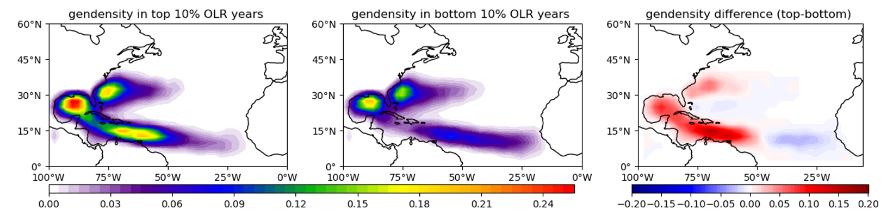
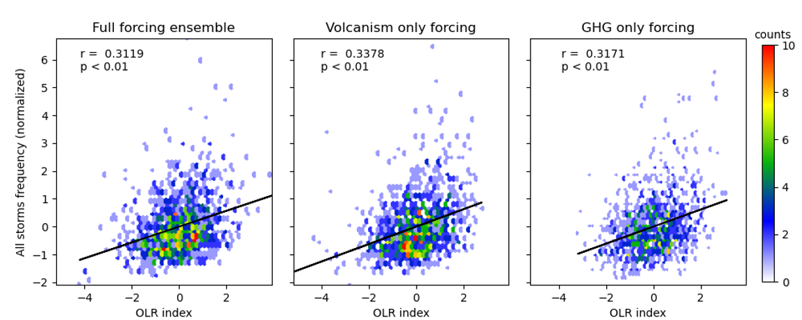
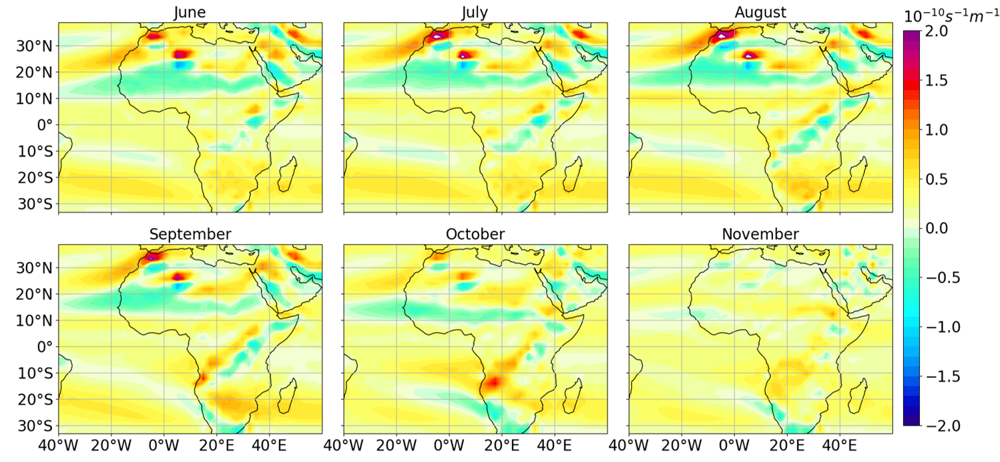
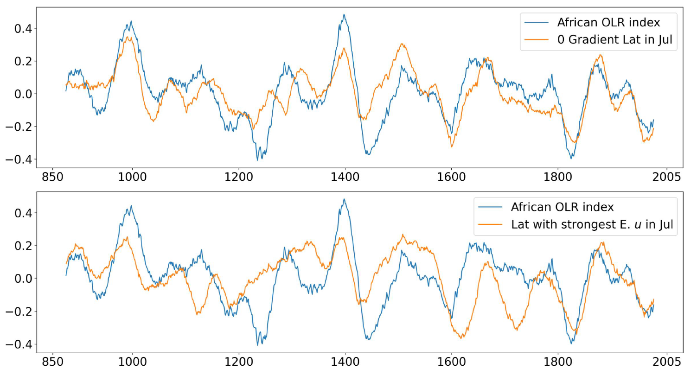

[Poster PDF link](/files/poster/AMS-35th-hurricane.pdf)

We study the relationship between the reversal of the meridional potential vorticity (PV) gradient, the instability of the African easterly jet (AEJ), and the Outgoing Longwave Radiation (OLR) index in CESM Last Millennium Ensemble to understand the physical relations of African OLR and Atlantic tropical cyclone (TC) genesis.

Fig. 1 From left to right: June-November genesis density in the years with top 10% African OLR indices, bottom 10% African OLR indices, and their differences. Storms are downscaled from CESM-LME full forcing member 7.

Fig. 2 shows that downscaled storm genesis density are positively correlated with African OLR indices. Correlation coefficients don’t differ much in the full forcing ensemble, volcanism only forcing, and GHG only forcing ensemble, indicating the relationship is persistent when different external forcings are applied.

Fig. 3 Long term mean (850-2005) quasi-geostrophic potential vorticity meridional gradient at 700 mb over Africa and east North Atlantic in full ensemble member 7

Fig. 4 Upper: Normalized time series of latitudes where the q meridional gradient changes its sign (averaged over 15°W-10°E, a 51-year Gaussian rolling mean with std=15 is applied) versus the OLR index. Bottom: Normalized time series of latitudes where the eastern zonal wind is strongest (averaged over 15°W-10°E, , a 51-year Gaussian rolling mean with std=15 is applied)versus the OLR index.

Summary and conclusions
=======================
* Downscaled storm genesis density in the CESM-LME simulation is enhanced in the years with large African OLR indices, in the area of Mexico Gulf, Caribbean sea, and the US east coast.
* Downscaled storm genesis in the CESM-LME simulation is significantly correlated with African OLR indices in all the three ensembles, suggesting this relationship is not climate dependent.
* When the strongest eastern zonal wind moves north, the quasi-geostrophic PV meridional gradient reversal also moves north, leads to larger African OLR indices.
* The downscaled storms are generated using the local environmental variables by randomly distributed seeds, while they are still affected by the jets in the western Africa.
